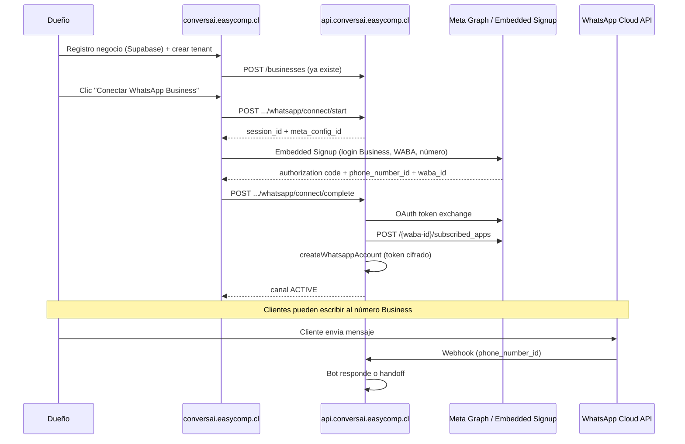

# Paso 2 — Embedded Signup: conectar WhatsApp Business por empresa

**Objetivo:** que el dueño de cada negocio registre **su número WhatsApp Business** (aprobado por Meta, vía la app EasyComp), sin copiar tokens manualmente. Tras la conexión, ese número recibe mensajes de clientes y el bot responde o deriva a humano.

**Prerrequisito:** [01-token-meta-permanente.md](./01-token-meta-permanente.md) completado para operar piloto y validar el runtime.

**Estado en código:** runtime listo; flujo OAuth / Embedded Signup **no implementado** (tabla `EmbeddedSignupSession` existió y fue eliminada en migración `20260608_spec_alignment`).

---

## Modelo de negocio (recordatorio)

```txt
Cliente final  →  escribe al número WhatsApp Business de la EMPRESA
Meta Cloud API →  webhook a EasyComp (un solo endpoint)
Backend        →  identifica empresa por phone_number_id
Bot            →  responde con FAQs/RAG/IA de ESE tenant
Handoff        →  alerta a operadores (TenantAdmin) vía panel + WhatsApp
```

- **Un número Business por tenant** (`TenantChannel`, unique `tenantId + channelType`).
- **Un motor de bot compartido**, configuración y conocimiento por `tenantId`.
- El teléfono del dueño en Meta es el del **negocio**, no un WhatsApp personal de operador.

---

## Qué ya existe (reutilizar)

| Pieza | Ubicación | Rol |
|-------|-----------|-----|
| Modelo canal | `prisma/schema.prisma` → `TenantChannel` | Guarda `phoneNumberId`, `wabaId`, token cifrado |
| Activar canal | `POST /businesses/:id/whatsapp-accounts` | Upsert del canal (última milla) |
| Resolver tenant | `TenantResolverService.resolveByChannel()` | `phone_number_id` → tenant |
| Webhook | `GET/POST /webhooks/whatsapp` | Entrada única para todos los tenants |
| Bot + handoff | `MessageRouterService`, `ResponsePipelineService`, `HandoffService` | Sin cambios previstos |
| Cifrado token | `encryptionService` + `ENCRYPTION_SECRET` | Obligatorio en producción |

**Conclusión:** el trabajo nuevo es la **capa de onboarding Meta** que termina llamando a `createWhatsappAccount` (o un wrapper).

---

## Qué falta construir

### Backend (`chat-whatsapp-ai`)

| Ítem | Descripción |
|------|-------------|
| Tabla sesión OAuth | Ej. `WhatsAppConnectionSession` (reemplazo de `EmbeddedSignupSession`) |
| `POST /businesses/:id/whatsapp/connect/start` | Crea sesión, devuelve config para el SDK de Meta |
| `POST /businesses/:id/whatsapp/connect/complete` | Recibe code/datos del frontend, canjea token, activa canal |
| `GET /businesses/:id/whatsapp/connect/status` | Estado: pending / completed / failed |
| Servicio Meta Graph | Intercambio code→token, suscripción WABA, validación número |
| Enum tenant | `PENDING_WHATSAPP_CONNECTION` en `TenantStatus` (existió en migración antigua) |
| Variables env nuevas | Ver sección [Variables de entorno](#variables-de-entorno) |

### Frontend (`chat-whatsapp-ai-ui`)

| Ítem | Descripción |
|------|-------------|
| Pantalla «Conectar WhatsApp» | Botón + estado del canal |
| Meta JS SDK / Embedded Signup | Flujo guiado de Meta en iframe o redirect |
| Callback al backend | Enviar `code`, `waba_id`, `phone_number_id` tras éxito |
| UX estados | Conectando, verificación pendiente, activo, error |

### Meta (configuración app)

| Ítem | Descripción |
|------|-------------|
| Embedded Signup | Configuración en App Dashboard → WhatsApp → Embedded Signup |
| App en modo Live | Para números reales fuera de lista de prueba |
| Business Verification | Requerida para producción estable |
| Tech Provider / Partner | Evaluar si EasyComp onboardará muchos negocios (ver docs Meta BSP) |

---

## Flujo objetivo (secuencia)



---

## Diseño de API propuesto

### `POST /businesses/:id/whatsapp/connect/start`

**Auth:** usuario autenticado en UI (futuro JWT) o `INTERNAL_API_KEY` en transición.

**Request:** (vacío o `{ "coexistence_enabled": false }`)

**Response:**

```json
{
  "session_id": "cuid...",
  "expires_at": "2026-07-14T12:00:00Z",
  "meta": {
    "app_id": "123456789",
    "config_id": "EMBEDDED_SIGNUP_CONFIG_ID",
    "redirect_uri": "https://conversai.easycomp.cl/settings/whatsapp/callback"
  }
}
```

**BD:** insert en `WhatsAppConnectionSession` con `status: PENDING`, `tenantId`, `expiresAt`.

---

### `POST /businesses/:id/whatsapp/connect/complete`

**Request:**

```json
{
  "session_id": "cuid...",
  "code": "AQBx...",
  "waba_id": "123456789",
  "phone_number_id": "987654321",
  "phone_number": "+56912345678"
}
```

**Pasos internos:**

1. Validar sesión PENDING y no expirada.
2. `GET https://graph.facebook.com/{version}/oauth/access_token` con `code`, `client_id`, `client_secret`, `redirect_uri`.
3. (Opcional) Intercambiar por long-lived token si aplica.
4. `POST /{waba-id}/subscribed_apps` con token de la app (suscribir webhooks del WABA a tu app).
5. Llamar lógica existente de `createWhatsappAccount` (mismo upsert `TenantChannel`).
6. Actualizar `Tenant.status` → `ACTIVE`.
7. Marcar sesión `COMPLETED`.

**Response:** mismo shape que `GET /businesses/:id` → `whatsapp_accounts[0]`.

**Errores:** guardar `lastError` en sesión, `status: FAILED`.

---

### `GET /businesses/:id/whatsapp/connect/status`

```json
{
  "connected": true,
  "channel": {
    "phone_number_id": "...",
    "phone_number": "+56...",
    "status": "ACTIVE",
    "waba_id": "..."
  },
  "pending_session": null
}
```

---

## Modelo de datos propuesto

Nueva tabla (nombre sugerido; no migrada aún):

```sql
-- Propuesta — NO aplicada en Prisma todavía
CREATE TYPE "WhatsAppConnectionStatus" AS ENUM (
  'PENDING', 'COMPLETED', 'FAILED', 'EXPIRED'
);

CREATE TABLE "WhatsAppConnectionSession" (
  "id"              TEXT PRIMARY KEY,
  "tenantId"        TEXT NOT NULL REFERENCES "Tenant"("id") ON DELETE CASCADE,
  "initiatedBy"     TEXT,              -- user id Supabase (futuro)
  "status"          "WhatsAppConnectionStatus" NOT NULL DEFAULT 'PENDING',
  "wabaId"          TEXT,
  "phoneNumberId"   TEXT,
  "phoneNumber"     TEXT,
  "lastError"       TEXT,
  "expiresAt"       TIMESTAMP(3) NOT NULL,
  "completedAt"     TIMESTAMP(3),
  "createdAt"       TIMESTAMP(3) NOT NULL DEFAULT CURRENT_TIMESTAMP,
  "updatedAt"       TIMESTAMP(3) NOT NULL
);

CREATE INDEX ON "WhatsAppConnectionSession" ("tenantId", "status");
```

**Ampliar `TenantStatus`:**

```prisma
enum TenantStatus {
  PENDING_WHATSAPP_CONNECTION
  ACTIVE
  PAUSED
}
```

**`TenantChannel`** — sin cambios estructurales; ya tiene `wabaId`, `coexistenceEnabled`, `status`.

---

## Llamadas Graph API necesarias

Base: `https://graph.facebook.com/{WHATSAPP_GRAPH_VERSION}/`

| Operación | Método | Referencia Meta |
|-----------|--------|-----------------|
| Intercambiar code por token | `GET /oauth/access_token` | [Manually build login flow](https://developers.facebook.com/docs/facebook-login/guides/advanced/manual-flow) |
| Suscribir app al WABA | `POST /{waba-id}/subscribed_apps` | [Subscribe to WABA webhooks](https://developers.facebook.com/docs/graph-api/reference/whats-app-business-account/subscribed_apps/) |
| Info del número | `GET /{phone-number-id}` | Ya usado en `test-whatsapp-token.ps1` |
| Registrar número (si aplica) | Flujo Embedded Signup | [Embedded Signup](https://developers.facebook.com/docs/whatsapp/embedded-signup) |

**Webhook:** el callback sigue siendo el único:

```txt
https://api.conversai.easycomp.cl/webhooks/whatsapp
```

Meta distingue tenants por `metadata.phone_number_id` en cada evento (ya implementado en `whatsapp.mapper.ts`).

---

## Variables de entorno (nuevas, propuesta)

Agregar en implementación futura a `src/config/env.ts`:

```env
# App de Meta (EasyComp ConversAI)
META_APP_ID=123456789012345
# META_APP_SECRET ya existe

# Embedded Signup — desde App Dashboard → WhatsApp → Embedded Signup
META_EMBEDDED_SIGNUP_CONFIG_ID=...

# Redirect URI registrado en la app (debe coincidir exacto)
META_OAUTH_REDIRECT_URI=https://conversai.easycomp.cl/settings/whatsapp/callback

# Token de System User de EasyComp (para subscribed_apps y operaciones de plataforma)
# META_SYSTEM_USER_ACCESS_TOKEN ya existe — ver paso 1
```

---

## Documentación oficial de Meta (implementación)

| Tema | URL |
|------|-----|
| WhatsApp Cloud API — overview | https://developers.facebook.com/docs/whatsapp/cloud-api/overview |
| Embedded Signup | https://developers.facebook.com/docs/whatsapp/embedded-signup |
| Embedded Signup — implementation | https://developers.facebook.com/docs/whatsapp/embedded-signup/implementation |
| Business Platform — get started | https://developers.facebook.com/docs/whatsapp/business-platform/get-started |
| System users | https://developers.facebook.com/docs/marketing-api/system-users/overview |
| Webhooks — WhatsApp | https://developers.facebook.com/docs/whatsapp/cloud-api/guides/set-up-webhooks |
| Permissions reference | https://developers.facebook.com/docs/permissions/reference |
| Tech Provider / BSP (si escalan muchos clientes) | https://developers.facebook.com/docs/whatsapp/solution-providers/get-started-for-tech-providers |

---

## UI — flujo sugerido (`chat-whatsapp-ai-ui`)

Al implementar, crear doc en el repo UI:

`chat-whatsapp-ai-ui/docs/cambios-ui-conexion-whatsapp-embedded-signup.md`

Contenido mínimo (regla del workspace):

1. **Resumen** — botón Conectar WhatsApp + callback
2. **Archivos tocados** — pantalla settings, hook Meta SDK
3. **Dependencias de deploy** — `META_EMBEDDED_SIGNUP_CONFIG_ID`, backend endpoints nuevos
4. **Cómo probar** — tenant nuevo → conectar → enviar «Hola» al número

---

## Coexistencia (opcional, fase 2)

Campo ya en schema: `TenantChannel.coexistenceEnabled`.

Permite usar el mismo número en **WhatsApp Business App** (celular del dueño) y **Cloud API** (bot). Requiere configuración específica en Embedded Signup y revisión de políticas Meta.

Documentación: [Coexistence](https://developers.facebook.com/docs/whatsapp/embedded-signup/custom-flows/coexistence)

Implementar después del flujo estándar Cloud API.

---

## Plan de implementación por fases

### Fase A — Piloto manual (ahora)

- [ ] Token permanente ([paso 1](./01-token-meta-permanente.md))
- [ ] `link-whatsapp-staging.ps1` por cada tenant piloto
- [ ] Validar bot + handoff E2E

### Fase B — Backend connect API

- [ ] Migración `WhatsAppConnectionSession` + `PENDING_WHATSAPP_CONNECTION`
- [ ] Servicio `meta-oauth.service.ts` (token exchange + subscribed_apps)
- [ ] Endpoints `connect/start`, `connect/complete`, `connect/status`
- [ ] Tests con mock Graph API

### Fase C — UI Embedded Signup

- [ ] Pantalla en settings del negocio
- [ ] Integrar Meta SDK según `config_id`
- [ ] Callback → `connect/complete`
- [ ] Doc UI `cambios-ui-conexion-whatsapp-embedded-signup.md`

### Fase D — Producción Meta

- [ ] App en modo Live
- [ ] Business Verification
- [ ] Evaluar Tech Provider si > N negocios
- [ ] Monitoreo expiración tokens por tenant (alertas)

---

## Criterios de aceptación (producción)

1. Dueño crea cuenta en UI y negocio (`Tenant`) sin intervención EasyComp.
2. Dueño conecta su WhatsApp Business en &lt; 10 min (flujo Meta estándar).
3. Tras conectar, `TenantChannel.status = ACTIVE` y `phone_number_id` único global.
4. Mensaje de cliente al número → bot responde con conocimiento de ese tenant.
5. Handoff notifica admins y conversación pasa a `HUMAN`.
6. Segundo tenant con otro número opera en paralelo sin cruce de datos.
7. Token del tenant cifrado en BD; no expuesto en frontend ni logs.

---

## Archivos del repo a tocar (referencia)

| Archivo | Cambio futuro |
|---------|---------------|
| `prisma/schema.prisma` | Modelo sesión + enum tenant |
| `src/modules/api/businesses.controller.ts` | Extraer `createWhatsappAccount` a servicio compartido |
| `src/modules/meta/` (nuevo) | OAuth, Graph, subscribed_apps |
| `src/modules/api/router.ts` | Rutas connect/* |
| `src/config/env.ts` | `META_APP_ID`, `META_EMBEDDED_SIGNUP_CONFIG_ID`, etc. |
| `chat-whatsapp-ai-ui` | Pantalla conexión (repo hermano) |

**No tocar** (salvo bugs): `message-router`, `response-pipeline`, `handoff`, `whatsapp.mapper`.

---

## Relación con token del paso 1

| Token | Quién | Cuándo |
|-------|-------|--------|
| System User EasyComp (`META_SYSTEM_USER_ACCESS_TOKEN`) | Plataforma | Piloto, `subscribed_apps`, operaciones admin |
| Token por tenant (`TenantChannel`) | Cada empresa | Tras Embedded Signup; es el que usa el bot para enviar como ese negocio |

En producción multi-tenant, **cada empresa debería tener su token en BD** generado en su propio flujo OAuth. El token global de EasyComp queda como fallback de emergencia o para scripts internos, no como único token de todos los clientes.
