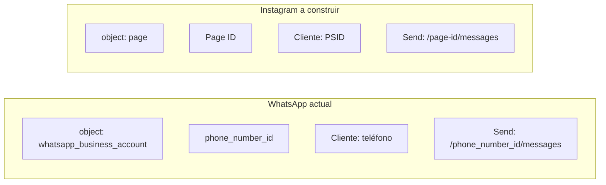

# Instagram Messaging — integración de conversaciones DM

**Objetivo:** recibir y responder mensajes directos de Instagram (cuenta Professional del negocio) con el mismo motor de bot multi-tenant (FAQ → RAG → IA → handoff) que ya opera en WhatsApp.

**Prerrequisito recomendado:** WhatsApp en producción estable ([01-token-meta-permanente.md](./01-token-meta-permanente.md), canal piloto conectado). Instagram es **Fase 3** del [SPEC.md](../../SPEC.md); no bloquea el piloto WA.

**Estado en código:** **no implementado**. El backend es 100 % WhatsApp Cloud API. No hay enums, webhooks, cliente Graph ni onboarding para Instagram.

---

## Modelo de negocio (objetivo)

```txt
Cliente final  →  escribe DM a la cuenta Instagram Professional de la EMPRESA
Meta Messenger →  webhook a EasyComp (endpoint IG o router unificado)
Backend        →  identifica empresa por Page ID (página FB vinculada a IG)
Bot            →  responde con FAQs/RAG/IA de ESE tenant
Handoff        →  alerta a operadores (panel; WhatsApp opcional como canal de alerta)
```

- **Un canal Instagram por tenant** (mismo patrón que `TenantChannel` + `channelType`).
- **Un tenant puede tener WhatsApp e Instagram a la vez** (decisión de producto; impacta constraints en BD).
- El motor de bot es compartido; la configuración y conocimiento siguen siendo por `tenantId`.

---

## Estado actual del backend

### Lo que sí existe y se reutiliza

| Pieza | Ubicación | Reutilizable para IG |
|-------|-----------|----------------------|
| Multi-tenant | `Tenant`, `TenantConfig`, FAQs, RAG | Sí |
| Pipeline bot | `ResponsePipelineService`, FAQ, RAG, IA | Sí, sin cambios de lógica |
| Cola/worker | BullMQ + Redis (`message.queue.ts`, `message.worker.ts`) | Sí; generalizar nombre de cola |
| Firma Meta | `meta-signature.middleware.ts` | Sí (`x-hub-signature-256`, `META_APP_SECRET`) |
| Cifrado tokens | `encryptionService` + `ENCRYPTION_SECRET` | Sí |
| Conversaciones/mensajes | `Conversation`, `Message` | Parcial — enum `channel` solo tiene `WHATSAPP` |
| Inbox API | `conversations-inbox.service.ts` | Parcial — ya expone `channel` en respuesta |

### Lo acoplado a WhatsApp (hay que abstraer o duplicar capa IG)

| Pieza | Ubicación | Problema |
|-------|-----------|----------|
| Webhook | `GET/POST /webhooks/whatsapp` | Payload y `object` distintos en IG |
| Mapper | `whatsapp.mapper.ts`, `whatsapp.schemas.ts` | Solo `whatsapp_business_account` |
| Cliente outbound | `whatsapp.client.ts` | `/{phone_number_id}/messages` + `messaging_product: whatsapp` |
| Resolver tenant | `TenantResolverService.resolveByChannel()` | Resuelve por `phone_number_id` |
| Identidad cliente | `Customer.phoneNumber` | IG usa **PSID**, no teléfono |
| Modelo canal | `TenantChannel` | Campos `phoneNumber`, `phoneNumberId` obligatorios |
| Handoff | `HandoffService` | Notifica agentes solo vía WhatsApp |
| APIs mensajes | `messages.controller.ts` | Asume canal WhatsApp activo |
| Onboarding | `POST /businesses/:id/whatsapp-accounts` | Manual; sin OAuth de página IG |

### Enums actuales (solo WhatsApp)

```prisma
enum ChannelType {
  WHATSAPP_BUSINESS
}

enum ConversationChannel {
  WHATSAPP
}
```

---

## WhatsApp vs Instagram DM (Meta)

Instagram Messaging es extensión de **Messenger Platform**, no de WhatsApp Cloud API.

| Aspecto | WhatsApp (hoy) | Instagram DM (a construir) |
|---------|----------------|----------------------------|
| Webhook `object` | `whatsapp_business_account` | `page` |
| Estructura payload | `entry[].changes[].value.messages[]` | `entry[].messaging[]` |
| Resolver tenant | `metadata.phone_number_id` | `entry.id` o `recipient.id` (**Page ID**) |
| ID del usuario | Teléfono E.164 (`from`) | **PSID** (`sender.id`) |
| Token por canal | WABA / phone token | **Page Access Token** |
| Envío Graph API | `POST /{phone_number_id}/messages` | `POST /{page-id}/messages` |
| Body envío | `messaging_product: "whatsapp"` | `recipient: { id: PSID }` (sin `messaging_product`) |
| Cuenta requerida | WABA + número | **Instagram Professional** + **Página FB vinculada** |
| Echoes (mensajes propios) | Campo separado | Incluidos en `messages` con `is_echo: true` — **filtrar** |
| Edición / borrado | Soportado en WA (reciente) | Limitado / distinto en IG |
| Ventana de respuesta | Reglas WA (24 h servicio, templates) | Ventana **24 h** estilo Messenger |



---

## Requisitos en Meta

### App y permisos (App Dashboard)

En la misma app Meta (o una dedicada):

| Permiso | Uso |
|---------|-----|
| `instagram_basic` | Datos básicos de la cuenta IG |
| `instagram_manage_messages` | Leer y responder DMs |
| `pages_manage_metadata` | Webhooks y metadata de página |
| `pages_messaging` | Enviar mensajes |
| `pages_show_list` | Listar páginas en onboarding |
| `business_management` | Onboarding multi-tenant (evaluar según modelo) |

**App Review:** para clientes reales fuera de roles de la app, se necesita **Advanced Access**. Sin revisión, solo funcionan usuarios con rol en la app.

**App publicada:** requerida para recibir webhooks de usuarios reales (independiente del estado de App Review).

Docs oficiales:

- [Instagram Messaging — Get Started](https://developers.facebook.com/docs/messenger-platform/instagram/get-started/)
- [Webhooks Instagram Messaging](https://developers.facebook.com/docs/messenger-platform/instagram/features/webhook/)
- [Messenger Platform Webhooks](https://developers.facebook.com/docs/messenger-platform/webhooks/)

### Por cada negocio (tenant)

1. Cuenta **Instagram Professional** (Business o Creator).
2. **Página de Facebook** vinculada a esa cuenta IG.
3. Mensajes de Instagram activados en la página.
4. Instalar la app en la página:

```http
POST /{page-id}/subscribed_apps?subscribed_fields=messages&access_token={PAGE_ACCESS_TOKEN}
```

5. Guardar **Page Access Token** de larga duración (cifrado en `TenantChannel`).

### Webhooks en Meta

| Campo | Valor sugerido |
|-------|----------------|
| Callback URL | `https://api.conversai.easycomp.cl/webhooks/instagram` |
| Verify token | Reutilizar `WHATSAPP_VERIFY_TOKEN` o `META_VERIFY_TOKEN` genérico |
| Campos | `messages` (mínimo); opcional: `messaging_postbacks`, reacciones |

Configurar en: App Dashboard → **Messenger** → **Instagram Settings** (recomendado por Meta para IG).

### Políticas operativas

- Ventana de **24 horas** para responder libremente.
- Fuera de ventana: restricciones (sin equivalente directo a templates de WA).
- Filtrar mensajes con `is_echo: true` para no re-procesar lo enviado por el negocio.
- Algunos tipos de mensaje IG no están soportados (GIF, stickers en ciertos contextos, etc.) — ignorar o fallback.

---

## Infraestructura

No requiere nuevo cluster; sí configuración y routing.

| Componente | Acción |
|------------|--------|
| ALB / reverse proxy | Exponer `GET/POST /webhooks/instagram` (o router `/webhooks/meta`) |
| Redis + workers | Misma infra; renombrar cola `whatsapp-messages` → `channel-messages` (opcional) |
| PostgreSQL | Migración de schema (ver abajo) |
| Variables env | Mismos `META_APP_SECRET`, `ENCRYPTION_SECRET`; verify token unificado opcional |
| Secrets AWS | Page Access Token por tenant (mismo patrón que WA) |
| Monitoring | Métricas/alertas por canal (fallos envío IG vs WA) |

---

## Qué falta construir

### Backend (`chat-whatsapp-ai`)

#### Fase A — Modelo de datos (Prisma)

```prisma
enum ChannelType {
  WHATSAPP_BUSINESS
  INSTAGRAM_MESSAGING
}

enum ConversationChannel {
  WHATSAPP
  INSTAGRAM
}
```

Cambios en `TenantChannel`:

- Añadir `pageId` (único, para IG) o campo genérico `externalChannelId`.
- Añadir `instagramUserId` (opcional, IG Business Account ID).
- Hacer `phoneNumber` / `phoneNumberId` opcionales según `channelType`.
- Revisar `@@unique([tenantId, channelType])` si un tenant puede tener WA **e** IG.

Cambios en `Customer`:

- Añadir `platformUserId` (PSID) + índice único `(tenantId, platform, platformUserId)`, o
- Generalizar identificador externo y dejar `phoneNumber` nullable para IG.

Cambios en `Conversation` / `Message`:

- `channelPhoneNumber` → `channelIdentifier` (teléfono o page ID).
- `whatsappDeliveryStatus` → generalizar a `deliveryStatus` o campo paralelo.

#### Fase B — Capa channel Instagram

| Archivo | Responsabilidad |
|---------|-----------------|
| `src/modules/channel/instagram.schemas.ts` | Zod del webhook `object: page` |
| `src/modules/channel/instagram.mapper.ts` | `messaging[]` → evento normalizado |
| `src/modules/channel/instagram.client.ts` | `POST /{page-id}/messages` |
| `src/modules/channel/instagram.controller.ts` | verify + receive webhook |
| `src/modules/channel/meta-webhook.controller.ts` (opcional) | Router por `req.body.object` |

Tipos canal-agnósticos (evolucionar `src/types/whatsapp.ts`):

```typescript
type NormalizedIncomingMessage = {
  channel: "whatsapp" | "instagram";
  externalMessageId: string;
  fromUserId: string;      // teléfono o PSID
  toChannelId: string;     // phone_number_id o page_id
  text: string;
  isEcho?: boolean;
  timestamp: Date;
  rawPayload: unknown;
};
```

#### Fase C — Routing

| Ítem | Descripción |
|------|-------------|
| `TenantResolverService` | `resolve({ channelType, externalId })` — Page ID para IG |
| `MessageRouterService` | Cliente según canal; filtrar `is_echo` |
| `MessageIngestService` | Conversación por `(tenantId, customerId, channel)` |
| Worker | Despachar eventos normalizados de ambos canales |

#### Fase D — APIs internas

| Endpoint | Descripción |
|----------|-------------|
| `POST /businesses/:id/instagram-accounts` | Upsert canal IG (pageId, token, igUserId) |
| `POST /businesses/:id/instagram/connect/start` | Sesión OAuth (Facebook Login) |
| `POST /businesses/:id/instagram/connect/complete` | Canje token + suscripción página |
| `GET /businesses/:id/instagram/connect/status` | Estado conexión |
| `messages.controller.ts` | Resolver canal según `conversation.channel` |

#### Fase E — Handoff

`HandoffService` hoy notifica por WhatsApp a `TenantAdmin.phoneNumber`.

Opciones MVP:

1. **Solo panel** (in-app / email) — recomendado para IG.
2. **Seguir alertando por WhatsApp** al operador aunque la conversación sea IG.

#### Fase F — Onboarding Meta (sin Embedded Signup de WA)

Flujo distinto al de WhatsApp Embedded Signup:

1. Facebook Login → permisos de página.
2. `GET /me/accounts` — listar páginas del usuario.
3. `GET /{page-id}?fields=instagram_business_account` — verificar IG vinculado.
4. Obtener Page Access Token de larga duración.
5. `POST /{page-id}/subscribed_apps`.
6. Guardar en `TenantChannel` vía API interna.

### Frontend (`chat-whatsapp-ai-ui`)

| Ítem | Descripción |
|------|-------------|
| Pantalla «Conectar Instagram» | Facebook Login + selección de página |
| Badge de canal en inbox | WA vs IG |
| Composer / detalle | No asumir teléfono del cliente (mostrar nombre / PSID truncado) |
| Doc UI | `chat-whatsapp-ai-ui/docs/cambios-ui-instagram.md` |

---

## Orden de implementación sugerido

```txt
1. Meta: permisos + webhook de prueba + 1 cuenta IG Professional piloto
2. Migración Prisma (enums, pageId, platformUserId)
3. Webhook IG + mapper + filtro is_echo
4. TenantChannel + TenantResolver por Page ID
5. InstagramClient (send text)
6. Integrar MessageRouter + ingest (conversación por canal)
7. API POST instagram-accounts + onboarding OAuth
8. UI inbox por canal
9. Handoff alternativo (panel / email)
10. App Review para producción
```

**Esfuerzo orientativo:** motor de bot ~70 % reutilizable; capa de canal + identidad + onboarding es trabajo nuevo (~2–4 semanas según paridad con WA en reacciones/edición).

---

## Qué se puede hacer ya (sin código)

1. Añadir producto **Messenger** en Meta Developers + Instagram Settings.
2. Preparar cuenta piloto (IG Professional + Page vinculada).
3. Registrar webhook apuntando a staging (puede devolver 501 hasta implementar).
4. Iniciar **App Review** de permisos (tarda semanas).
5. Decidir producto: ¿un tenant con WA **e** IG simultáneos?

---

## Resumen ejecutivo

| Área | Listo | Falta |
|------|-------|-------|
| Infra | Redis, workers, firma Meta, cifrado | Ruta webhook IG |
| Código core bot | FAQ, RAG, IA, decision engine | Casi nada |
| Código canal | Solo WhatsApp | Webhook, mapper, client, resolver IG |
| BD | Conversaciones genéricas | Enums, TenantChannel, Customer PSID |
| Meta | App + secret compartibles | Permisos IG, Page linking, App Review |
| UI | Campo `channel` en inbox | Conectar IG, UX omnicanal |

---

## Relación con otros docs

| Doc | Relación |
|-----|----------|
| [02-embedded-signup-whatsapp-business.md](./02-embedded-signup-whatsapp-business.md) | Patrón de onboarding; IG usa Facebook Login + página, no Embedded Signup WA |
| [01-token-meta-permanente.md](./01-token-meta-permanente.md) | System User token; IG usa Page Access Token por tenant |
| [SPEC.md](../../SPEC.md) §18 Fase 3 | Instagram DM en roadmap oficial |
| [README.md](../../README.md) | Arquitectura actual solo WhatsApp |

## Dominios del proyecto

| Qué | URL |
|-----|-----|
| UI | `https://conversai.easycomp.cl` |
| API | `https://api.conversai.easycomp.cl` |
| Webhook WhatsApp (hoy) | `https://api.conversai.easycomp.cl/webhooks/whatsapp` |
| Webhook Instagram (propuesto) | `https://api.conversai.easycomp.cl/webhooks/instagram` |
