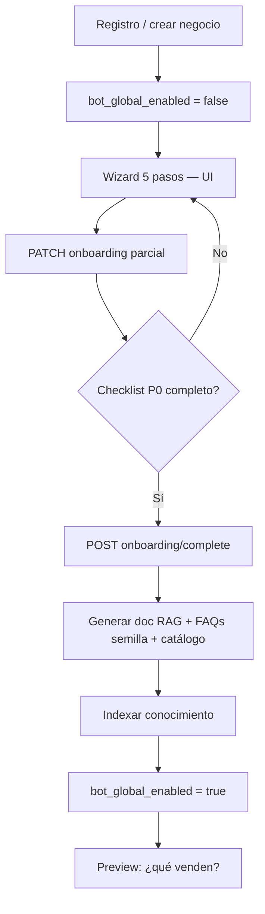
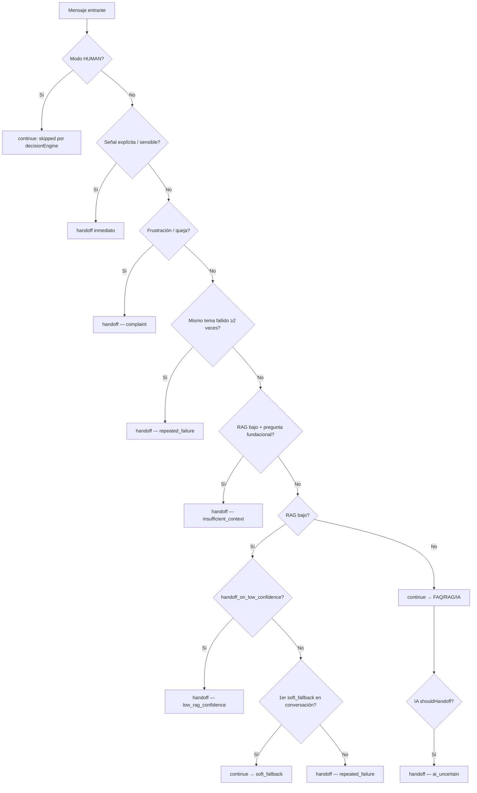

# Backend — Onboarding de negocio + Escalation Detector

## Resumen

Dos piezas complementarias para evitar conversaciones como *"¿qué venden?" → "No tengo esa información" → cliente frustrado*:

1. **Setup wizard (onboarding)** — al registrar un negocio, recopilar datos mínimos y generar automáticamente FAQs + documento RAG antes de activar el bot.
2. **Escalation Detector** — módulo que evalúa en paralelo cada mensaje entrante y decide: responder, clarificar, o derivar a humano (sin más respuestas genéricas en cadena).

**Estado:** implementado en backend (escalation detector + API onboarding). Pendiente wizard UI en `chat-whatsapp-ai-ui`.

### Modo desarrollo (onboarding omitible)

Por defecto en `NODE_ENV=development` o `test`, el onboarding **no es obligatorio**:

| Variable | Efecto |
|----------|--------|
| *(omitida en dev)* | `onboarding_required: false` en `setup-status`; wizard omitible |
| `ONBOARDING_REQUIRED=false` | Igual, explícito en cualquier entorno |
| `ONBOARDING_REQUIRED=true` | Fuerza gate de producción en local |

Cuando el onboarding no es requerido:
- `POST /businesses` crea el tenant con `bot_global_enabled: true`
- `bot_global_enabled: false` **no bloquea** el runtime (pipeline y decision engine siguen respondiendo)
- `GET setup-status` devuelve `can_go_live: true`, `progress_percent: 100`

**Tenants existentes** no se modifican; siguen con su `bot_global_enabled` actual (normalmente `true`).

---

## Problema que resuelve

| Hoy | Deseado |
|-----|---------|
| `POST /businesses` crea tenant sin FAQs ni KB | Wizard genera base sólida antes del go-live |
| `bot_global_enabled: true` por defecto | Bot inactivo hasta completar checklist P0 |
| `handoff_on_low_confidence: false` por defecto | `true` en tenants nuevos post-onboarding |
| Fallback genérico en cadena | Máx. 1 soft_fallback → handoff automático |
| Handoff solo por keywords explícitos | Matriz de señales (confianza, bucle, frustración, tema fundacional) |

Referencias de industria: Intercom Fin, Zendesk AI Agent, patrón WhatsApp two-way handoff (escalación como señal paralela, no rama del árbol).

---

## Parte 1 — Onboarding / Setup wizard

### Flujo de producto



### Rutas UI sugeridas (`chat-whatsapp-ai-ui`)

| Ruta | Contenido |
|------|-----------|
| `/onboarding` o `/negocios/nuevo/setup` | Wizard completo (post-registro) |
| `/negocios/:id/setup` | Reanudar wizard incompleto |
| Banner en dashboard | "Completa la configuración (60%)" si `can_go_live === false` |

### API nueva (backend)

Autenticación: igual que el resto — `X-API-Key` / `Authorization: Bearer`.

#### `GET /businesses/:id/setup-status`

Devuelve progreso, checklist y si el bot puede activarse.

**Response 200:**

```json
{
  "setup_version": 1,
  "completed_at": null,
  "progress_percent": 60,
  "can_go_live": false,
  "bot_global_enabled": false,
  "checklist": {
    "identity": { "done": true, "required": true },
    "offerings": { "done": true, "required": true },
    "operations": { "done": false, "required": true },
    "human_contact": { "done": true, "required": true },
    "bot_identity": { "done": true, "required": true },
    "whatsapp_channel": { "done": false, "required": false },
    "knowledge_indexed": { "done": false, "required": true }
  },
  "missing_for_go_live": ["operations.schedule", "knowledge_indexed"],
  "draft": {
    "identity": { "business_type": "products", "description": "Panadería artesanal..." },
    "offerings": [{ "name": "Pan amasado", "description": "...", "price": 1200 }],
    "operations": { "schedule": null, "city": "Santiago", "payment_methods": ["efectivo"] }
  }
}
```

#### `PATCH /businesses/:id/onboarding`

Guarda borrador parcial (idempotente). No activa el bot ni genera KB.

**Body (todos los campos opcionales):**

```json
{
  "identity": {
    "business_type": "products",
    "description": "Panadería artesanal en Santiago. Vendemos pan, empanadas y pasteles."
  },
  "offerings": [
    {
      "type": "product",
      "name": "Pan amasado",
      "description": "Pan tradicional horneado diario",
      "price": 1200,
      "currency": "CLP"
    }
  ],
  "operations": {
    "schedule": "Lun–Vie 8:00–20:00, Sáb 9:00–14:00",
    "city": "Santiago",
    "commune": "Providencia",
    "address": "Av. Providencia 1234",
    "payment_methods": ["efectivo", "transferencia", "tarjeta"],
    "delivery_notes": "Despacho en RM con cargo según comuna"
  },
  "human_contact": {
    "admin_name": "María",
    "admin_phone": "+56912345678",
    "notify_on_handoff": true
  },
  "bot_identity": {
    "bot_name": "Sol",
    "bot_tone": "profesional y cercano",
    "greeting_message": "Hola, soy Sol de Panadería Sol."
  }
}
```

**Validaciones por campo (checklist / `complete`; el PATCH no 400 por incompleto):**

| Campo | Regla |
|-------|-------|
| `identity.description` | ≥ 50 caracteres para marcar `identity.done` |
| `offerings` | ≥ 1 ítem con `name` + `description` ≥ 10 chars |
| `operations.schedule` | no vacío |
| `operations.payment_methods` | ≥ 1 |
| `human_contact.admin_phone` | E.164 válido |
| `bot_identity.bot_name` | ≥ 1 char |

**Response 200:** mismo shape que `setup-status` actualizado.

#### `POST /businesses/:id/onboarding/complete`

Ejecuta generación de conocimiento y activación. **409** si `can_go_live === false`.

**Body opcional:**

```json
{
  "enable_bot": true,
  "handoff_on_low_confidence": true
}
```

**Efectos atómicos (transacción):**

1. Upsert `TenantAdmin` primario si `human_contact` viene en draft.
2. Actualizar `TenantConfig` (`botName`, `botTone`, `greetingMessage`, mensajes si el usuario los editó).
3. Crear/actualizar documento `TenantDocument` título **`Perfil del negocio`** (`sourceType: MANUAL`, `rawText` generado).
4. Crear FAQs semilla (ver sección [FAQs auto-generadas](#faqs-auto-generadas)).
5. Crear `TenantCatalogProduct` por cada offering con precio.
6. Encolar indexación (`enqueueKnowledgeIndex`).
7. Actualizar `Tenant.metadataJson.setup` → `completed_at`, `progress_percent: 100`.
8. Si `enable_bot`: `Tenant.botGlobalEnabled = true`.
9. En `TenantConfig.configJson`: `handoff_on_low_confidence: true` (default post-onboarding).

**Response 200:**

```json
{
  "completed_at": "2026-07-31T22:00:00.000Z",
  "bot_global_enabled": true,
  "generated": {
    "document_id": "clx...",
    "faq_ids": ["clx...", "clx..."],
    "catalog_product_ids": ["clx..."]
  },
  "indexing": {
    "document_status": "PENDING",
    "message": "El perfil se indexará en segundos. El bot puede responder FAQs de inmediato."
  }
}
```

#### Cambio en `POST /businesses` (create)

| Campo | Antes | Después |
|-------|-------|---------|
| `bot_global_enabled` | `true` (default Prisma) | `false` explícito al crear |
| `metadataJson.setup` | — | `{ "version": 1, "started_at": "..." }` |

Los tenants existentes no se modifican (migración opcional aparte).

---

### `metadataJson.setup` (Tenant)

Sin migración SQL obligatoria en v1. Estructura:

```json
{
  "setup": {
    "version": 1,
    "started_at": "2026-07-31T20:00:00.000Z",
    "completed_at": null,
    "draft": {
      "identity": {},
      "offerings": [],
      "operations": {},
      "human_contact": {},
      "bot_identity": {}
    },
    "checklist": {
      "identity": false,
      "offerings": false,
      "operations": false,
      "human_contact": false,
      "bot_identity": false,
      "knowledge_indexed": false
    },
    "generated": {
      "profile_document_id": null,
      "seed_faq_ids": [],
      "catalog_product_ids": []
    }
  }
}
```

**`can_go_live`** (calculado, no persistido):

```typescript
canGoLive =
  checklist.identity &&
  checklist.offerings &&
  checklist.operations &&
  checklist.human_contact &&
  checklist.bot_identity &&
  (hasActiveWhatsappChannel || allowPilotWithoutChannel) // ver nota piloto
```

**Nota piloto:** en staging se puede permitir go-live sin canal WA (`ALLOW_GO_LIVE_WITHOUT_CHANNEL=true`) para probar RAG/FAQs; en producción exigir `TenantChannel` activo.

---

### Texto auto-generado — documento RAG

Plantilla (`buildBusinessProfileDocument`):

```text
# Perfil del negocio — {business_name}

## Qué somos
{identity.description}

## Tipo de negocio
{identity.business_type}: products | services | both

## Qué ofrecemos
{for each offering}
- {name}: {description}{price_line}
{end}

## Horario de atención
{operations.schedule}

## Ubicación y cobertura
Ciudad: {operations.city}
Comuna: {operations.commune}
Dirección: {operations.address}
{operations.delivery_notes}

## Medios de pago
{operations.payment_methods joined}

## Atención humana
Si el cliente pide hablar con una persona, un asesor del negocio lo atenderá.
```

Tras crear/actualizar el doc → `enqueueKnowledgeIndex(documentId, tenantId)`.

Marcar `knowledge_indexed: true` cuando `TenantDocument.status === INDEXED` (webhook/worker o poll en `setup-status`).

---

### FAQs auto-generadas

Crear con `source` lógico `generated_onboarding` en `category` o `keywords` para no duplicar en re-runs.

| # | question | alternate_phrases (ejemplos) | answer (plantilla) |
|---|----------|------------------------------|-------------------|
| 1 | ¿Qué venden o qué servicios ofrecen? | qué venden, qué ofrecen, a qué se dedican, qué productos tienen | `{description}` + lista de offerings |
| 2 | ¿Cuál es su horario de atención? | horario, a qué hora abren, hasta qué hora atienden | `{schedule}` |
| 3 | ¿Dónde están ubicados? | dirección, ubicación, dónde quedan | `{address}, {commune}, {city}` |
| 4 | ¿Qué medios de pago aceptan? | formas de pago, cómo puedo pagar, aceptan tarjeta | lista payment_methods |
| 5 | ¿Cómo puedo hablar con una persona? | quiero un humano, hablar con alguien, asesor | "Escribe 'hablar con asesor' y te conectamos con el equipo." |
| 6+ | ¿Cuánto cuesta {offering.name}? | precio de {name}, valor {name} | `{price} {currency}` o "Consultar en tienda" |

**Re-run `complete`:** upsert por `category: onboarding_seed` + `question` normalizada; no duplicar.

---

### Gate en runtime (bot apagado)

Si `bot_global_enabled === false` y llega mensaje de cliente final:

```typescript
// message-router / response-pipeline
if (!tenant.botGlobalEnabled) {
  return {
    reply: tenant.config?.outOfHoursMessage ?? 
      "Hola. Estamos configurando nuestro asistente. Te responderemos muy pronto.",
    mode: "bot",
    skipped: false // opcional: no persistir como bot si preferís silencio total
  };
}
```

Alternativa más estricta: `skipped: true` (silencio total hasta go-live). **Recomendado para prod:** un solo mensaje automático por conversación cada 24h.

---

### Archivos backend sugeridos

| Archivo | Responsabilidad |
|---------|-----------------|
| `src/modules/onboarding/onboarding.schema.ts` | Zod schemas |
| `src/modules/onboarding/onboarding.service.ts` | draft, checklist, complete |
| `src/modules/onboarding/business-profile.builder.ts` | doc RAG + FAQs semilla |
| `src/modules/onboarding/setup-status.service.ts` | `can_go_live`, progress % |
| `src/modules/api/onboarding.controller.ts` | handlers HTTP |
| `src/modules/api/router.ts` | registrar rutas |
| `src/modules/api/businesses.controller.ts` | `createBusiness` → `botGlobalEnabled: false` |

### Tests mínimos

- `complete` sin draft completo → 409
- `complete` con draft P0 → crea doc + N FAQs + products
- Re-`complete` → idempotente (no duplica FAQs semilla)
- `setup-status` refleja `progress_percent` correcto
- Tenant con `bot_global_enabled: false` → pipeline no responde con IA completa

---

## Parte 2 — Escalation Detector

### Objetivo

Centralizar la decisión **antes** de generar respuesta. El `response-pipeline.service.ts` delega en:

```typescript
type EscalationAction =
  | { action: "continue" }
  | { action: "clarify"; message: string }
  | { action: "handoff"; reason: HandoffReason; customerMessage?: string };

escalationDetector.evaluate(input): Promise<EscalationAction>
```

### Orden de evaluación (prioridad descendente)



### Señales detalladas

#### 1. Explícita / sensible (ya existe — mover a detector)

`detectHandoffReason()` en `prompts.ts`:

- `user_requested_human`, `complaint`, `warranty_return`, `special_quote`, `sensitive_topic`

**Ampliar `INTENT_HINTS.complaint`:**

```typescript
complaint: [
  "reclamo", "queja", "molesto", "enojado", "pesimo", "pésimo",
  "mal servicio", "que mal", "qué mal", "no sirven", "horrible",
  "inaceptable", "una vergüenza", "pésima atención", "peor servicio"
]
```

#### 2. Frustración heurística (fase A — sin LLM)

`detectFrustrationSignals(text, recentMessages)` → score 0–1:

| Señal | Peso |
|-------|------|
| `!!` o `???` repetidos | +0.2 |
| MAYÚSCULAS > 50% del mensaje (>8 chars) | +0.25 |
| Keyword complaint (ampliado) | +0.5 |
| Mensaje anterior fue `soft_fallback` o `fallbackMessage` | +0.3 |
| "como no", "no puede ser", "en serio" | +0.2 |

Umbral: **≥ 0.5** → `handoff` reason `complaint` (o nuevo `customer_frustrated`).

#### 3. Bucle / fallos repetidos

Persistir en conversación (v1 sin migración):

**Opción A (recomendada v1):** `Conversation` no tiene JSON → usar tabla ligera o campos en último mensaje bot.

**Opción B (v2):** migración `Conversation.metadataJson`:

```json
{
  "escalation_state": {
    "consecutive_soft_fallbacks": 1,
    "last_bot_response_type": "soft_fallback",
    "last_user_intent_hash": "abc123",
    "repeated_intent_count": 2
  }
}
```

Reglas:

- Tras enviar `soft_fallback` → incrementar contador.
- Tras respuesta FAQ/RAG/IA exitosa → reset contador.
- `consecutive_soft_fallbacks >= 2` → `handoff` reason `repeated_failure` (nuevo).

#### 4. Preguntas fundacionales + RAG bajo

Intents que **nunca** deben recibir solo soft_fallback:

```typescript
const FOUNDATIONAL_INTENTS = [
  /qu[eé]\s+venden/i,
  /qu[eé]\s+ofrecen/i,
  /qu[eé]\s+productos/i,
  /qu[eé]\s+servicios/i,
  /a\s+qu[eé]\s+se\s+dedican/i,
  /qui[eé]nes\s+son/i,
  /de\s+qu[eé]\s+trata/i
];
```

Si match + `bestRagScore < threshold` → `handoff` `insufficient_context` (no soft_fallback).

#### 5. Baja confianza RAG

Si `handoff_on_low_confidence === true` (default post-onboarding) → handoff directo.  
Si `false` → máximo 1 soft_fallback por conversación (regla 3).

#### 6. IA incierta

Mantener `openAiService.shouldHandoff()` pero **después** del detector pre-IA; si la IA ya corrió y pide derivar → handoff `ai_uncertain`.

### Nuevo `HandoffReason`

```typescript
| "repeated_failure"
| "customer_frustrated"  // opcional: separar de complaint
```

Labels para inbox:

```typescript
repeated_failure: "El bot no pudo resolver tras varios intentos",
customer_frustrated: "Cliente muestra frustración o molestia",
```

### Mensajes al cliente por motivo

No usar un solo `handoff_message` para todo. Resolver en `handoff-message.resolver.ts`:

| reason | Mensaje sugerido |
|--------|------------------|
| `user_requested_human` | "Claro, te conecto con un asesor de {negocio} ahora mismo." |
| `complaint` / `customer_frustrated` | "Entiendo tu molestia. Un asesor te atenderá personalmente en breve." |
| `low_rag_confidence` / `insufficient_context` | "No tengo ese dato confirmado. Te paso con alguien del equipo que te puede ayudar." |
| `repeated_failure` | "Veo que no te he podido ayudar bien. Te conecto con un asesor." |
| `ai_uncertain` | "Prefiero que un asesor te confirme esto. Te contactamos enseguida." |
| default | `tenant.config.handoffMessage` |

Configurable luego en `bot-personality` (fase 2); v1 hardcoded por reason con fallback al tenant.

### Integración en pipeline

```typescript
// response-pipeline.service.ts — inicio de process(), tras decisionEngine
const escalation = await escalationDetector.evaluate({
  tenant, conversation, customer, incomingText,
  ragScore: bestScore, // si ya se calculó; si no, detector hace retrieve ligero
  conversationalConfig,
  recentMessages: await getLastNMessages(conversationId, 6)
});

if (escalation.action === "handoff") {
  const message = resolveHandoffCustomerMessage(escalation.reason, tenant);
  const result = await handoffService.execute({ ... , handoffReason: escalation.reason });
  // persistir + return mode human
}
if (escalation.action === "clarify") {
  // persistir clarify message, return bot
}
// escalation.action === "continue" → flujo actual FAQ/RAG/IA
```

**Importante:** tras `handoffService.execute`, `decisionEngine` ya bloquea respuestas bot (`human_mode`). No enviar segundo mensaje.

### Archivos backend sugeridos

| Archivo | Responsabilidad |
|---------|-----------------|
| `src/modules/runtime/escalation-detector.service.ts` | Matriz de señales |
| `src/modules/runtime/frustration-heuristics.ts` | Score sin LLM |
| `src/modules/runtime/foundational-intent.ts` | Regex intents fundacionales |
| `src/modules/runtime/handoff-message.resolver.ts` | Copy por reason |
| `src/modules/runtime/conversation-escalation-state.ts` | contador soft_fallback |
| `src/modules/runtime/response-pipeline.service.ts` | integrar detector |
| `src/modules/runtime/prompts.ts` | nuevos reasons + hints |

### Config en `bot-personality` (fase 2 UI)

```json
{
  "escalation": {
    "handoff_on_low_confidence": true,
    "max_soft_fallbacks_before_handoff": 1,
    "frustration_threshold": 0.5,
    "handoff_messages_by_reason": {
      "complaint": "Entiendo tu molestia..."
    }
  }
}
```

v1: defaults en código; post-onboarding `handoff_on_low_confidence: true`.

### Tests mínimos

- "qué venden?" + RAG 0.2 + sin onboarding → handoff `insufficient_context` (no soft_fallback)
- soft_fallback × 2 → `repeated_failure`
- "que mal servicio" tras fallback → handoff `complaint` en mensaje 1 del detector
- modo HUMAN → detector no aplica
- `user_requested_human` → handoff sin pasar por IA

---

## Parte 3 — UI (`chat-whatsapp-ai-ui`)

> El agente backend **no implementa** estos archivos; spec para el equipo UI.

### Wizard — 5 pasos

| Paso | Título | Campos | API |
|------|--------|--------|-----|
| 1 | Tu negocio | tipo, descripción (textarea ≥50) | `PATCH onboarding` |
| 2 | Qué ofreces | lista 1–3 ítems (nombre, desc, precio opcional) | `PATCH onboarding` |
| 3 | Operación | horario, ciudad, pagos (chips) | `PATCH onboarding` |
| 4 | Contacto | admin nombre/tel, notify handoff | `PATCH onboarding` |
| 5 | Tu bot | nombre, tono, saludo + **preview** | `PATCH` + `POST complete` |

**Preview paso 5:** llamar FAQ local o `GET` simulado mostrando respuesta a "¿qué venden?".

### Componentes sugeridos

| Ruta UI | Qué hace |
|---------|----------|
| `app/onboarding/page.tsx` | Wizard container + progress bar |
| `components/onboarding/offering-list-editor.tsx` | Alta/edición ítems |
| `components/onboarding/setup-checklist.tsx` | Banner dashboard incompleto |
| `lib/api/onboarding.ts` | `getSetupStatus`, `patchOnboarding`, `completeOnboarding` |

### Inbox — badge handoff

Mostrar `handoff_reason` traducido (`HANDOFF_REASON_LABELS`). Nuevos: `repeated_failure`, `customer_frustrated`.

---

## Plan de implementación

| Fase | Entregable | Esfuerzo |
|------|------------|----------|
| **1A** | Escalation detector fase A (heurísticas + bucle + foundational) | 2–3 días |
| **1B** | Mensajes handoff por reason | 0.5 día |
| **2A** | API onboarding (status, patch, complete) + profile builder | 2–3 días |
| **2B** | `createBusiness` gate + runtime bot apagado | 0.5 día |
| **3** | UI wizard (repo UI) | 3–5 días |
| **4** | Sentimiento LLM (opcional) | 2 días |

**Orden recomendado:** 1A → 1B → 2A → 2B en backend; UI wizard en paralelo desde 2A.

---

## Dependencias de deploy

| Componente | Requisito |
|------------|-----------|
| Postgres | v1 sin migración; v2 opcional `Conversation.metadataJson` |
| Redis / worker | Indexación KB existente (`knowledge-index` queue) |
| OpenAI | Embeddings para RAG (ya en uso) |
| UI | Consumir nuevos endpoints; banner setup incompleto |
| Variables | `ALLOW_GO_LIVE_WITHOUT_CHANNEL` opcional staging |

---

## Cómo probar

### Onboarding

1. `POST /businesses` → verificar `bot_global_enabled: false`.
2. `PATCH /businesses/:id/onboarding` con draft parcial → `progress_percent` sube.
3. `POST .../complete` sin P0 → 409.
4. Completar draft → FAQs + doc `Perfil del negocio` en BD.
5. Esperar `INDEXED` → `knowledge_indexed: true`, `can_go_live: true`.
6. WhatsApp: "¿qué venden?" → respuesta desde FAQ/RAG, no fallback.

### Escalation

1. Tenant sin KB, pregunta fundacional → handoff sin soft_fallback.
2. Forzar 2 soft_fallbacks → tercer mensaje escala.
3. "como no vas a saber!! que mal servicio" → handoff `complaint` + mensaje empático.
4. Tras handoff, nuevo mensaje cliente → bot silencioso (`human_mode`).

---

## Relación con docs existentes

| Doc | Relación |
|-----|----------|
| [bot-personalidad-configuracion-ui.md](../to-front/bot-personalidad-configuracion-ui.md) | `handoff_on_low_confidence`, mensajes base |
| [spec-ui-knowledge-base.md](../spec-ui-knowledge-base.md) | FAQs y documentos post-onboarding |
| [codex_spec_whatsapp_ai_saas_mvp.md](../../codex_spec_whatsapp_ai_saas_mvp.md) | Onboarding WA original (referencia; priorizar wizard web) |
| `src/modules/runtime/response-pipeline.service.ts` | Punto de integración del detector |
| `src/modules/runtime/handoff.service.ts` | Ejecución handoff (sin cambios mayores) |

---

## Fuera de alcance v1

- Onboarding conversacional por WhatsApp (número EasyComp) — fase posterior.
- Sentimiento con LLM dedicado.
- CSAT post-handoff.
- Dashboard analytics de knowledge gaps (usar `faq-suggestions` existente como base).
